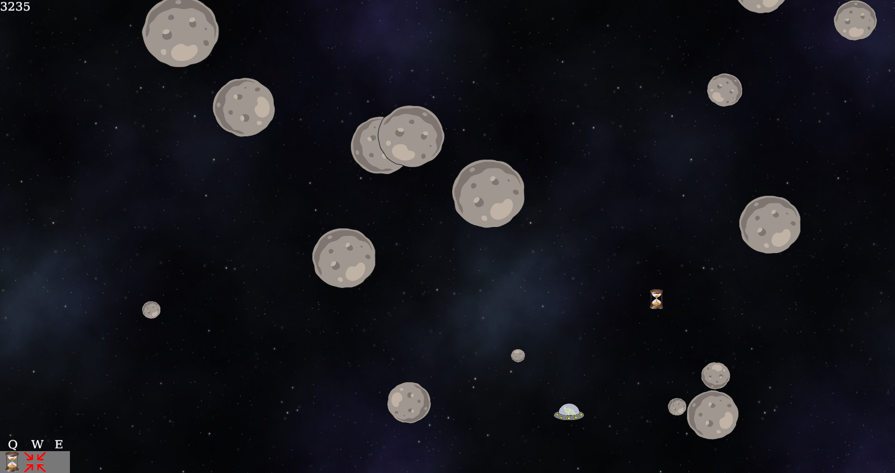

# Rust-Space-Game
Made for an assignment for KTH course DD1337

The player (frog in spaceship) is controlled using the arrow keys. 
Power-ups can be obtained by letting the player touch them. They are activated by using the respective key indicated at the inventory HUD in the bottom left corner of the screen.

## Game screenshot

Background image: https://www.flickr.com/photos/webtreatsetc/5436446554/
All other images and sounds are either made by me or free to use without any need of providing the source.

